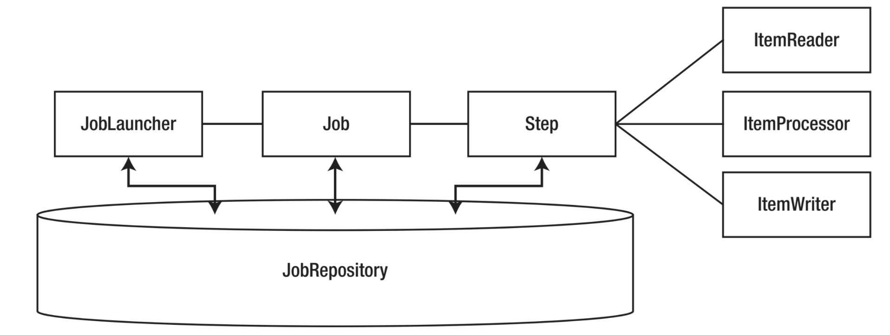

## Spring Batch Examples

This repository contains basic examples of Spring Batch.

Spring Batch facilitate developers' life when writing applications to process large amounts of data without human intervention.
You’d opt to use batch applications to compute data for generating monthly financial statements, calculating statistics, and indexing files.



#### Running

Any branch can be fetched and executed with the shell script below.

```bash
./build.sh
```